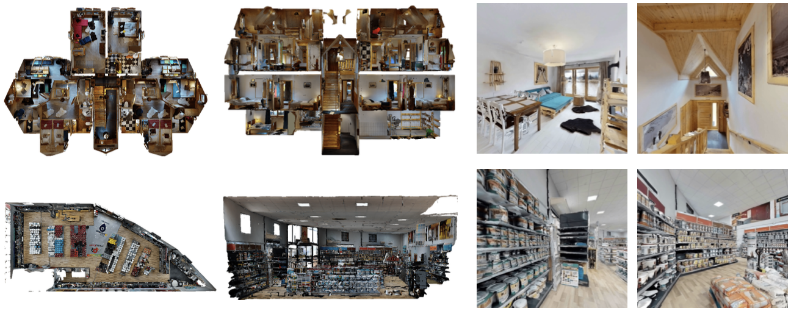
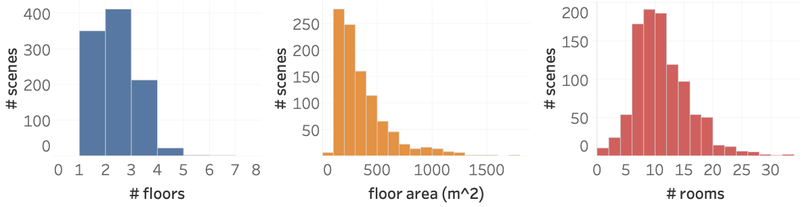

# Habitat-Matterport 3D Dataset(HM3D): 1000 Large-scale 3D Environments for Embodied AI (ArXiv'21.09)

> Sanhosh K.Ramakrishnan, Araon Gokaslan, Erik Wijmans, Oleksandr Maksymets, Alex Clegg, John Turner, Eric Undersander, Wojciech Galuba, Andrew Westbury, Angel X.Chang, Manolis Savva, Yili Zhao, Dhruv Batra

[Page Link](https://graphics.stanford.edu/projects/bundlefusion/](https://aihabitat.org/datasets/hm3d/)  

---
## System Overview
.  
Two example scenes from HM3D dataset

### Main Differences from Prev works
Upto 1,000 building scale scene. 
.  
1. Scale: Handling much larger places w.r.t prev works (ScanNet, SceneNN individual room scale scene)
- Significantly higher total naviable area (1.4-3.7 times larger)

2. Completeness: Providing near-complete w.r.t prev building scale works (BuildingParser, Matterport3D, Gibson are incomplete recon)
- Reflected 34-91% reduction in reconstruction artifacts due to missing surfaces, holes, or untextured surface regions compare to photorealistic 3D dataset. (Reduces seeing through a hole in the wall effect when training embodied AI)

3. Visual Fidelity: 
- 20-85% higher than prior large-scale datasets.

---
### Improvements
1. Still have defects in reconstruction. 
2. The dataset is mainly for training embodied AI
